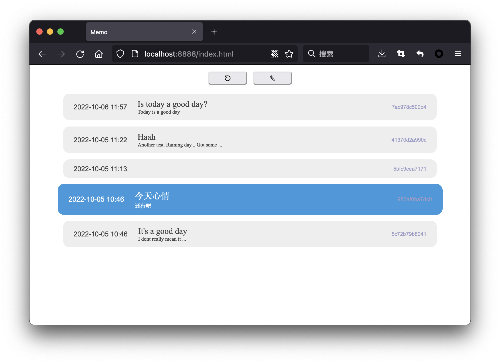

# Memo

A simple diary app.  
Use sqlite to save data, python-tornado backend and pure javascript (typescript) frontend.



## Deployment

Runtime prerequisites: Python, Typescript

#### Installation
```bash
# compile typescript
tsc
# install python packages
pip install -r requirements.txt
```

#### Register user
```bash
# example, more usage see: python -m memo.backend.auth -h
# change ... to your value
python -m memo.backend.auth -r '{ "usr_id": "...", "usr_name": "...", "passwd": "..."}'
```

#### Start server
```bash
# start at designated port
# change ... to your value
python -m memo.server -p ...
```
